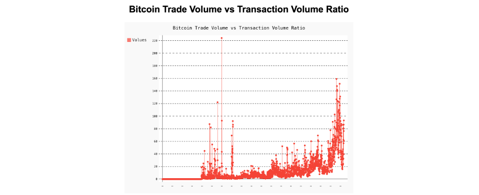
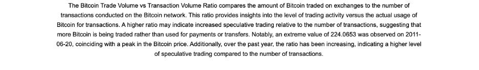
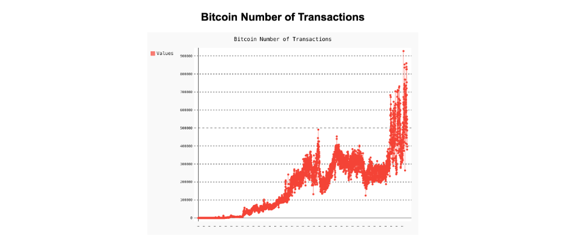
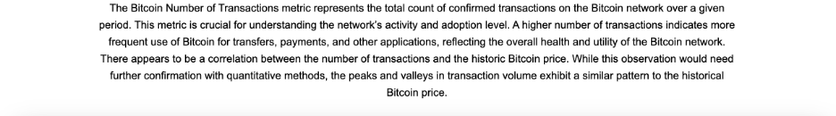

# 
 Real-Time Bitcoin Metrics Dashboard: Visualizing Trade and Transaction Data 

## Introduction & Context

This project is a Bitcoin Metrics Dashboard implemented using Flask. It provides a visual representation of Bitcoin-related metrics, including the trade volume vs transaction volume ratio and the number of transactions on the Bitcoin network. The dashboard fetches real-time Bitcoin price data and historical metrics from Nasdaq Data Link and displays them through interactive charts.

## Flow of the Data Architecture

The data for this project is sourced from Nasdaq Data Link. The key components are:

1. **Data Retrieval**: The `nasdaqdatalink` library is used to fetch data from the Nasdaq Data Link API. Specifically, the Bitcoin price and various Bitcoin metrics such as trade volume vs transaction volume ratio and the number of transactions are retrieved. See [Nasdaq API](https://www.nasdaq.com/solutions/data-link-api)
   
2. **Data Processing**: The retrieved data is processed to extract relevant information, including the latest Bitcoin price and historical metrics. This data is then used to generate visualizations.

3. **Visualization Creation**: The `pygal` library is used to create interactive SVG charts based on the processed data. The charts are saved as SVG files in the `templates` folder.

4. **Web Application**: The Flask application serves the data and charts on a web page. The `index.html` file renders the latest Bitcoin price and the generated charts, providing users with insights into Bitcoin metrics.

## Conclusions

The Bitcoin Metrics Dashboard offers valuable insights into Bitcoin trading activity and network usage. By visualizing metrics such as the trade volume vs transaction volume ratio and the number of transactions, users can better understand market dynamics and network adoption. The dashboard highlights trends and provides context for Bitcoin’s historical performance and trading behavior.

## Screenshot of the Webpage

